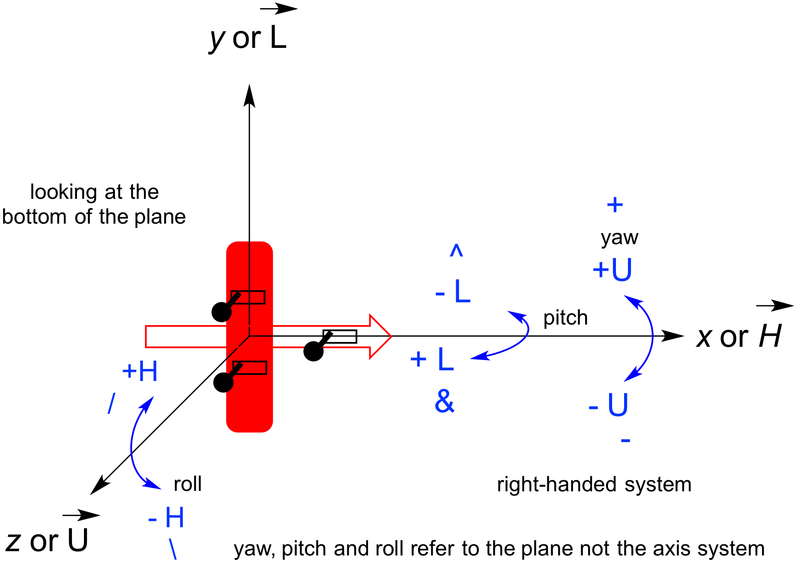
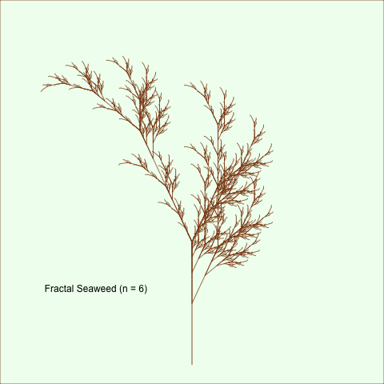

### LindenmayeR
#### Functions to Explore L-Systems (Lindenmayer Systems)

`LindenmayeR is a WORK IN PROGRESS`.  The fundamental structures & behavior may change at any time.  Check the NEWS file.

`LindenmayeR` currently implements 2-dimensional, deterministic, context-free L-systems, or DOLs.  Wikipedia has a very good introduction [page](https://en.wikipedia.org/wiki/L-system) to the topic.

Numerous implementations of L-systems can be found on the web (github has plenty).  I believe this is the first one in `R` and it is intended as an exploratory and learning tool.

At this time, I am trying to make sure that the basic actions exist and that everything works as desired by implementing some examples from the Wikipedia page, as well as the material in the early pages of the book by [Prusinkiewicz and Lindenmayer](http://algorithmicbotany.org/papers/#abop).  Insofar as possible I am trying to use standard conventions.  Current examples include simple fractals and some basic plant-like structures.

The long term goal is to implement awesome 3D examples.  I'm in no particular hurry.  This interests me because the diagrams simulating plant growth are beautiful and interesting.  Long after Lindenmayer's work, it appears that the growth forms of plants work on a molecular level exactly as he imagined, via homebox type genes.  See Lippman ZB, Cohen O, Alvarez JP, Abu-Abied M, Pekker I, *et al.* (2008) The making of a compound inflorescence in tomato and related nightshades. [PLoS Biol 6(11): e288](http://dx.doi.org/10.1371/journal.pbio.0060288)

Here is the coordinate system used in the 3D implementation.

#### License Information

`LindenmayeR` is distributed under the GPL-3 license, as stated in the DESCRIPTION file.  For more info, see the [GPL site.](https://gnu.org/licenses/gpl.html)

Questions?  hanson@depauw.edu

#### Lagniappe

